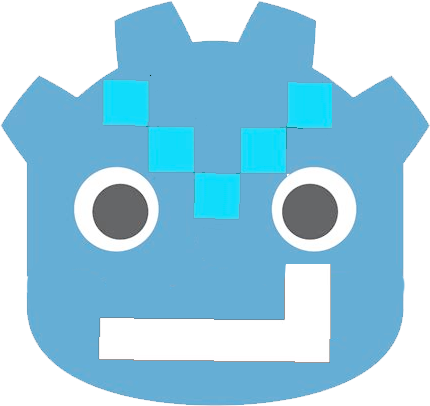

# Godot-LiveKit



**Godot-LiveKit** is a GDExtension for Godot 4.5 that integrates the [LiveKit C++ SDK](https://github.com/livekit/client-sdk-cpp), allowing you to build real-time voice, video, and data applications directly within the Godot Engine using GDScript or C#.

## Features

- **Real-Time Communication**: Seamlessly connect to LiveKit servers for audio, video, and data streaming.
- **Fast Build Times**: Uses prebuilt binaries for both `godot-cpp` and the LiveKit C++ SDK, reducing compilation time to seconds instead of hours.
- **Cross-Platform**: Supports Linux, macOS (Universal), and Windows (via MinGW cross-compilation).
- **Native GDExtension**: Works out-of-the-box with Godot 4.5 without requiring custom engine builds.

## Prerequisites

To build the extension from source, you will need:

- **Python 3.x**
- **SCons** (`pip install scons`)
- **CMake** (Optional, for advanced builds)

**Platform-Specific Requirements:**
- **Linux:** `g++`, `curl`, `tar`, `unzip`
- **macOS:** Xcode Command Line Tools, `curl`, `tar`, `unzip`
- **Windows:** MinGW-w64 (if cross-compiling from Linux/macOS)

## Building from Source

This repository includes a custom `build.sh` script that automatically fetches the required LiveKit C++ SDK and `godot-cpp` prebuilt binaries, and compiles the extension.

1. **Clone the repository:**
   ```bash
   git clone https://github.com/NodotProject/godot-livekit.git
   cd godot-livekit
   ```

2. **Run the build script for your platform:**

   - **Linux:**
     ```bash
     ./build.sh linux
     ```
   - **macOS:**
     ```bash
     ./build.sh macos
     ```
   - **Windows:**
     ```bash
     ./build.sh windows
     ```

Once the build is complete, the compiled dynamic libraries (`.so`, `.dylib`, or `.dll`) and the LiveKit shared libraries will be placed in the `addons/godot-livekit/bin/` directory.

## Usage in Godot

1. Copy the `addons/godot-livekit` folder into your Godot project's `addons/` directory.
2. Enable the plugin from the Godot Editor: **Project -> Project Settings -> Plugins**.
3. You can now access LiveKit classes (e.g., `LiveKitRoom`) directly from GDScript:

```gdscript
extends Node

var room: LiveKitRoom

func _ready():
    room = LiveKitRoom.new()
    # LiveKit API implementation details go here...
```

## Running Tests

If you have [GUT (Godot Unit Test)](https://github.com/bitwes/Gut) installed in `addons/gut`, you can run the test suite using the provided `test.sh` script:

```bash
./test.sh
```

## Continuous Integration

The project is configured with GitHub Actions to automatically build releases for Linux, Windows, and macOS whenever a new tag (e.g., `v1.0.0`) is pushed. Check the `.github/workflows` directory for details.

## License

This project is licensed under the MIT License. See the [LICENSE](LICENSE) file for more information. Note that the LiveKit C++ SDK is licensed under the Apache License 2.0.