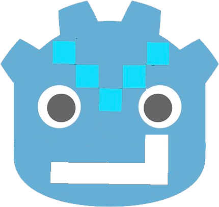

# Godot-LiveKit



**Godot-LiveKit** is a GDExtension for Godot 4.5 that integrates the [LiveKit C++ SDK](https://github.com/livekit/client-sdk-cpp), allowing you to build real-time voice, video, and data applications directly within the Godot Engine using GDScript or C#.

## Features

- **Real-Time Communication**: Connect to LiveKit servers for audio, video, and data streaming.
- **Full Track Support**: Publish and subscribe to audio/video tracks, with local sources for capturing from Godot.
- **Screen Capture**: Capture monitors or individual windows natively using the built-in `LiveKitScreenCapture` class (macOS, Windows, Linux).
- **Audio Processing**: Apply WebRTC echo cancellation, noise suppression, and gain control to audio captured in Godot via `LiveKitAudioProcessingModule`.
- **Data Channels**: Send and receive arbitrary data messages with reliable or unreliable delivery.
- **RPC Support**: Perform remote procedure calls between participants.
- **End-to-End Encryption (E2EE)**: Secure your media streams with configurable encryption, key management, and per-participant frame cryptors.
- **Connection Statistics**: Access detailed WebRTC statistics including inbound/outbound RTP, codecs, transport, and candidate pair metrics.
- **Fast Build Times**: Uses prebuilt binaries for the LiveKit C++ SDK, reducing compilation time to minutes instead of hours.
- **Cross-Platform**: Supports Linux, macOS (arm64 and x86_64), Windows, and Android (arm64).
- **Native GDExtension**: Works out-of-the-box with Godot 4.5 without requiring custom engine builds.

## Prerequisites

To build the extension from source, you will need:

- **Python 3.x**
- **SCons** (`pip install scons`)
- **CMake** (Optional, for advanced builds)

**Platform-Specific Requirements:**
- **Linux:** `g++`, `curl`, `tar`, `unzip`
- **macOS:** Xcode Command Line Tools, `curl`, `tar`, `unzip`
- **Windows:** MSVC (Visual Studio Build Tools), run from Git Bash. Cross-compiling from Linux with MinGW-w64 is not supported, because the prebuilt LiveKit C++ SDK for Windows is built with MSVC and its C++ ABI is incompatible with MinGW.
- **Android:** Android NDK (r26d is used in CI) with `ANDROID_NDK_ROOT` or `ANDROID_NDK_HOME` set, plus `curl`, `tar`, `unzip`

## Building from Source

This repository includes a custom `build.sh` script that automatically fetches the prebuilt LiveKit C++ SDK, builds `godot-cpp` from source (once; the result is cached in `godot-cpp/`), and compiles the extension.

1. **Clone the repository:**
   ```bash
   git clone https://github.com/NodotProject/godot-livekit.git
   cd godot-livekit
   ```

2. **Run the build script for your platform:**

   - **Linux:**
     ```bash
     ./build.sh linux
     ```
   - **macOS:**
     ```bash
     ./build.sh macos
     ```
   - **Windows:**
     ```bash
     ./build.sh windows
     ```
   - **Android (arm64):**
     ```bash
     ./build.sh android
     ```

   Add `--debug` to build the `template_debug` variant, or `--double --api-file=extension_api.json` to build for a double-precision Godot build (`precision=double`), where `extension_api.json` is generated by your double-precision Godot binary with `godot --dump-extension-api`. Double-precision libraries are named `libgodot-livekit.<platform>.double.<arch>` and are picked up automatically by double-precision Godot builds.

Once the build is complete, the compiled dynamic libraries (`.so`, `.dylib`, or `.dll`) and the LiveKit shared libraries will be placed in the `addons/godot-livekit/bin/` directory.

## Usage in Godot

1. Copy the `addons/godot-livekit` folder into your Godot project's `addons/` directory.
2. Enable the plugin from the Godot Editor: **Project -> Project Settings -> Plugins**.
3. You can now access LiveKit classes directly from GDScript:

```gdscript
extends Node

var room: LiveKitRoom

func _ready():
    room = LiveKitRoom.new()
    room.connected.connect(_on_connected)
    room.participant_connected.connect(_on_participant_connected)
    room.track_subscribed.connect(_on_track_subscribed)
    room.data_received.connect(_on_data_received)
    room.connect_to_room("wss://your-server.url", "your-token", {})

# No _process() needed — rooms, video streams, and screen captures are
# auto-polled every frame by default. Set auto_poll = false if you prefer
# to call poll_events() / poll() manually.

func _on_connected():
    print("Connected as: ", room.get_local_participant().get_identity())

func _on_participant_connected(participant):
    print("Joined: ", participant.get_identity())

func _on_track_subscribed(track, publication, participant):
    print("Track subscribed: ", track.get_name())

func _on_data_received(data, participant, kind, topic):
    print("Data from ", participant.get_identity(), ": ", data.get_string_from_utf8())
```

### Android

On Android, WebRTC does all microphone and speaker I/O through its `org.webrtc` Java classes, so they must be included in your app or it aborts when connecting to a room. They are shipped as `addons/godot-livekit/bin/android-arm64/libwebrtc.jar`. To include them:

1. Install the Android build template: **Project -> Install Android Build Template**.
2. Copy `libwebrtc.jar` into `android/build/libs/debug/` and `android/build/libs/release/`.
3. Enable **Use Gradle Build** in your Android export preset, along with the `RECORD_AUDIO`, `MODIFY_AUDIO_SETTINGS` and `INTERNET` permissions.

### Screen Capture

You can capture screens and windows natively:

```gdscript
var capture = LiveKitScreenCapture.create()
capture.frame_received.connect(_on_frame)
capture.start()

func _on_frame():
    var image = capture.get_image()
    # Feed into a LiveKitVideoSource for screen sharing
```

## Running Tests

If you have [GUT (Godot Unit Test)](https://github.com/bitwes/Gut) installed in `addons/gut`, you can run the test suite using the provided `test.sh` script:

```bash
./test.sh
```

## Continuous Integration

The project is configured with GitHub Actions to automatically build releases for Linux, Windows, macOS, and Android whenever a new tag (e.g., `v1.0.0`) is pushed. Check the `.github/workflows` directory for details.

## License

This project is licensed under the MIT License. See the [LICENSE](LICENSE) file for more information. Note that the LiveKit C++ SDK is licensed under the Apache License 2.0.